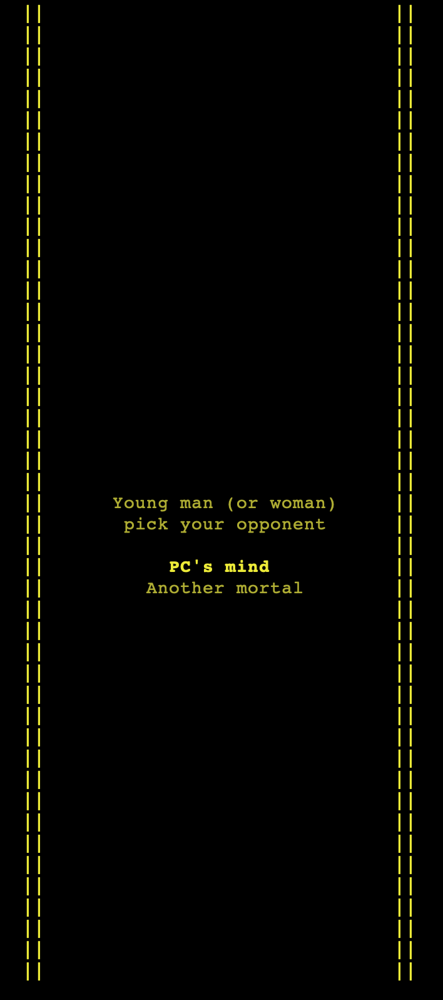
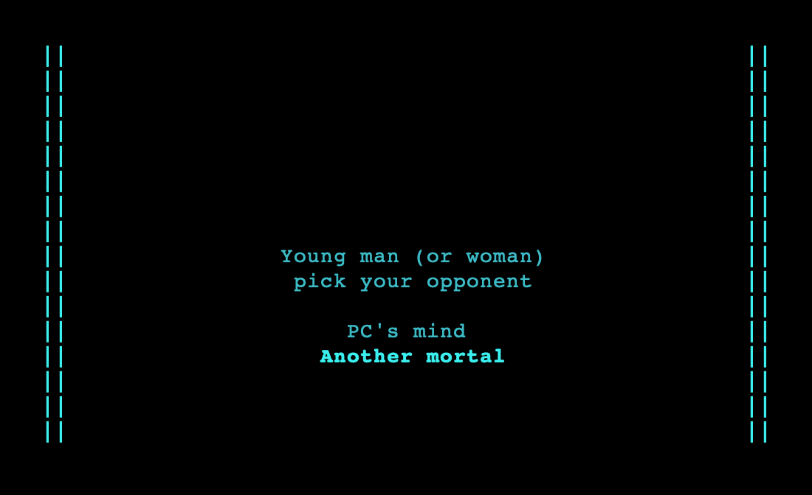

# Dodge

Original UNIX game Dodge with C++, featuring graphics, database, leaderboard, and player modes 

### Why?

Started as a project for my UNIX class with a prompt from the professor *"Make something that uses curses and gdbm. Grade based on impression"*, I found myself get sucked in by its potential, of all the things I could come up with to add in this game. Even after my submission, I still continued developing, coming up with new ideas to make the game fun and *unpredictable*. I eventually slowed down on making new updates, but still have in mind a many more ideas to expand the game.

A simple game that is constructed with the principle of Object Oriented Design in mind. It is made to be able to integrate with further development, functions, modes, etc. 

It can be used as a helpful tool to teach programming due to its simplicity and great potential. Dodge is easy to understand, easy to integrate, leaving room for everyone to meddle around with their own creativity.

### Prerequisites

First you have to install `gdbm` for database and `ncurses` for graphics. Open your Terminal, run:
```
brew install ncurses
brew install gdbm
```

## Getting Started

Clone the project to where you want to have it on your local machine

### Running

After cloning the project, inside the directory by
```
cd Dodge
```
For the first time running, type
```
make
```
Now, everytime you want to play, just have to type
```
./game
```

### Dodge


### PC mode


### Dual Players Mode



**Enjoy the game!**

## Versions

* **Version 2.0:** Major update release.
  * Featuring **dual players mode**
  * Fixed database error that caused it to run out of memory
  * Fixed speed transition to make its increasement smoother
* **Version 2.1:** Minor bugs fixed
  

## Author

* [**Nhan Cao**](https://www.linkedin.com/in/nhan-cao/)
